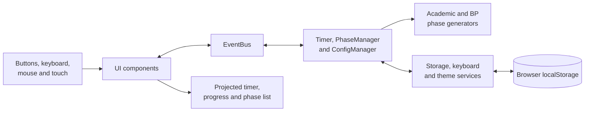

# ADA Debate Timer

[Versión en español](README.es.md) | [Open live application](https://cronometro-ada.vercel.app/)

A projection-ready web timer designed and built as a personal project for the **Alicante Debate Association (ADA)**. It supports Academic and British Parliamentary debate formats, configurable timings, phase navigation, keyboard operation, and persistent local settings.

> The interface is in Spanish because the application was created for ADA's speakers, judges, and tournament staff in Alicante.

## Why This Project

Debate sessions contain many timed interventions with different speakers, durations, and rules. A generic stopwatch forces organizers to track that sequence separately and is difficult to read when projected in a room.

ADA Debate Timer combines the complete running order with a large-format countdown. It lets the operator configure a debate once, move safely between phases, and keep the current speaker and remaining time visible to everyone.

## Features

- **Two debate formats:** configurable Academic Debate and eight-speech British Parliamentary.
- **Projection-ready display:** large responsive timer, current speaker, phase progress, and clear visual states.
- **Overtime tracking:** continues below zero instead of stopping when an intervention runs over time.
- **Visual warnings:** changes to yellow during the final 10 seconds and red after 10 seconds of overtime.
- **Flexible configuration:** team names, speech durations, number of rebuttal rounds, shorter final rebuttals, deliberation, and feedback.
- **Phase control:** previous, next, and direct phase navigation, disabled while the timer is running to prevent accidental changes.
- **Interactive timeline:** click, drag, or touch the progress bar to adjust the current phase.
- **Keyboard-first operation:** shortcuts for timing, navigation, configuration, format selection, and theme switching.
- **Responsive interface:** designed for projectors, laptops, tablets, and mobile devices.
- **Persistent preferences:** configuration and theme are stored in the browser with `localStorage`; no account or backend is required.
- **Adaptive theme:** light and dark modes with system-preference detection.

## Supported Formats

### Academic Debate

The Academic format generates the full sequence from configurable values:

1. Introduction by Team A and cross-examination.
2. Introduction by Team B and cross-examination.
3. Alternating rebuttal rounds for both teams.
4. Conclusion by Team B followed by Team A.
5. Judges' deliberation and feedback.

Default timings are 4-minute introductions, 2-minute cross-examinations, three 5-minute rebuttal rounds with an optional 90-second final round, and 3-minute conclusions.

### British Parliamentary

The British Parliamentary format includes the standard eight speeches:

1. Prime Minister
2. Leader of the Opposition
3. Deputy Prime Minister
4. Deputy Leader of the Opposition
5. Member of Government
6. Member of the Opposition
7. Government Whip
8. Opposition Whip

Speech duration defaults to 7 minutes. Team names are configurable for the opening and closing government and opposition benches. Deliberation and feedback phases are included after the speeches.

## Architecture

The application uses framework-free JavaScript modules. UI components communicate through a small event bus, keeping the timer engine, phase generation, browser storage, and DOM rendering independent.



The timer is synchronized against wall-clock timestamps rather than relying only on interval ticks. This reduces drift when the browser is busy or deprioritizes the tab.

## Technology Stack

| Area | Technology |
| --- | --- |
| Application | Vanilla JavaScript, ES modules, HTML5 |
| Styling | Modular CSS, custom properties, responsive breakpoints |
| Build tooling | Vite 7 |
| Persistence | Browser `localStorage` |
| Hosting | Vercel |
| CI deployment | GitHub Actions workflow for GitHub Pages |

## Project Structure

```text
src/
|-- components/     # Timer, controls, phase list, configuration and theme UI
|-- core/           # Timer engine, phase manager, configuration and event bus
|-- formats/        # Academic and British Parliamentary phase generators
|-- services/       # Browser storage, keyboard shortcuts and theme preference
|-- styles/         # Design tokens, layout, component and responsive styles
`-- main.js         # Application composition and event wiring
```

## Keyboard Controls

Keyboard controls can be disabled from the configuration panel and are ignored while typing in form fields.

<details>
<summary>Show all shortcuts</summary>

| Key | Action |
| --- | --- |
| `Space` | Start, pause, or resume |
| `R` | Reset the current phase |
| `D` | Reset the complete debate |
| `Left` / `Right` | Previous or next phase |
| `Up` / `Down` | Add or subtract 10 seconds |
| `+` / `-` | Add or subtract 30 seconds |
| `,` / `.` | Add or subtract 1 second |
| `C` | Open or close configuration |
| `F` | Open or close the phase list |
| `1` / `2` | Select Academic or British Parliamentary format |
| `H` | Show or hide keyboard help |
| `T` | Toggle light and dark mode |
| `Enter` | Apply the open configuration form |
| `Escape` | Close open panels |

</details>

## Run Locally

### Requirements

- Node.js `20.19+` or `22.12+`
- npm

Install dependencies and start the development server:

```bash
npm install
npm run dev
```

The application opens at [http://localhost:3000](http://localhost:3000).

Create and preview a production build:

```bash
npm run build
npm run preview
```

## Data and Privacy

The application has no backend and does not collect user data. Debate configuration and theme preferences remain in the current browser. Clearing site storage removes those preferences.

The deployed application loads its assets over the network; local persistence means that using the timer does not require registration or a remote database, not that the deployment is an installable offline PWA.

## Deployment

The production application is hosted on Vercel:

**[cronometro-ada.vercel.app](https://cronometro-ada.vercel.app/)**

The repository also contains a GitHub Actions workflow that builds the Vite application for GitHub Pages on pushes to `master`.

## Background

This is a personal project developed for the [Alicante Debate Association](https://www.instagram.com/ada_debate/). It translates real debate-room requirements into a focused tool for speakers, judges, and event organizers.
